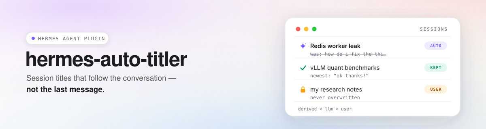

<div align="center">



# hermes-auto-titler

**Session titles that follow the conversation — not just the opening prompt.**

[](LICENSE)

*Topic-aware session title maintenance for [Hermes Agent](https://github.com/NousResearch/hermes-agent), with provenance-safe writes and long-horizon intent tracking.*

[Features](#-features) · [How it works](#-how-it-works) · [Install](#-install) · [Configuration](#%EF%B8%8F-configuration) · [Commands](#-commands) · [简体中文](README.zh-CN.md)

</div>

---

Hermes can name a session from its opening exchange. But conversations evolve; their titles often don't. A chat that begins with *"what's the vLLM quant format?"* can turn into a two-day deployment project while the sidebar label remains anchored to the opening prompt.

**hermes-auto-titler** maintains that label across the session lifecycle. It periodically checks whether an auto-generated title still represents the user's durable subject and intended outcome, updates it when the conversation genuinely changes direction, and never overwrites a title you set yourself.

```text
┌─ SESSIONS ────────────────────────────────────────────────┐
│  ✦ Redis worker leak                          [AUTO]      │
│    was: how do i fix the thi…                             │
│  ✓ vLLM quant benchmarks                      [KEPT]      │
│    newest: "ok thanks!"                                   │
│  🔒 my research notes                         [USER]      │
│    never overwritten                                      │
│                                                           │
│  derived < llm < user                                     │
└───────────────────────────────────────────────────────────┘
```

## ✨ Features

| | |
|---|---|
| **Provenance-safe** | Enforces `derived < llm < user`. `derived` = Hermes' deterministic fallback from the first message; `llm` = model-generated; `user` = yours, **never overwritten**. Old titles with no provenance (pre-provenance rows) are treated as user-set and protected too. |
| **Long-horizon intent tracking** | Combines opening turns, recent turns, a capped user-message trajectory, and compaction summaries when the original opening is gone. Long messages use head+tail extraction so late instructions are not lost. |
| **Intent-aware capture** | Filters Hermes compaction handoffs, system noise, adjacent replay duplicates, and internal cron/subagent/background turns before they can distort the title. |
| **Native first-title coexistence** | `first_title_mode: builtin` (default) leaves the first title to Hermes and maintains it later. `plugin` lets this plugin own the first title too. |
| **Optional review gate** | `rename_confirmations: 0` writes an approved llm→llm rename directly. `1` holds the candidate for one additional evaluation, where the model can approve, replace, or drop it. `renames_per_hour` adds a separate churn cap. |
| **Call-efficient by design** | Turn cadence, per-session time throttling, provenance checks, in-flight dedup, and internal-turn exclusion prevent most foreground turns from making a model call. |
| **Conservative surface cleanup** | Preserves literal identifiers, adds safe CJK↔Latin spacing, and only normalizes name casing when the current conversation provides evidence for that casing. |
| **Profile-isolated and auditable** | SessionDB handles are cached per Hermes profile, and real model calls are recorded under `task=hermes_auto_titler`. |

> ⚠️ **Privacy / data flow — read before enabling**
> The plugin sends selected conversation text to the title model: opening/recent excerpts, a sampled user-message trajectory, compacted history summaries when applicable, and attachment filename placeholders. Scope is controlled by `opening_turns`, `recent_turns`, `preview_chars`, `include_all_user_messages`, `user_message_threshold`, `user_message_preview_chars`, `summary_preview_chars`, and `retitle_summary_chars`. Calls count against the selected provider's usage and billing.

## 🔍 How it works

1. **Choose first-title ownership** — by default Hermes handles the first title through its built-in `title_generation` auxiliary task. In `first_title_mode: plugin`, this plugin evaluates from the first completed turn and disables the competing host title generator at plugin load.
2. **Trigger and gate** — hooks `on_session_end` / `on_session_finalize`. Completed foreground turns count toward `every_n_turns`; failed/interrupted turns and cron/subagent/bg-review work do not. Periodic evals run in a daemon worker; close/finalize evals run synchronously and still honor `min_interval_minutes`.
3. **Build intent context** — opening turns + recent turns (each selected turn keeps the user message and last assistant reply) + a capped first-and-recent user trajectory. If compaction removed the original opening, the earlier summary becomes a separate historical anchor. Handoff wrappers and replay noise are removed before sampling.
4. **Judge the subject, not the mechanism** — the auxiliary model returns strict JSON. The prompt prioritizes the durable subject and intended outcome over recency, treats code/logs/commands as context, and uses a counterfactual rule to avoid naming incidental tools unless the tool itself is the object of the session.
5. **Optionally review a rename** — with `rename_confirmations: 1`, an llm→llm rename becomes a pending candidate. The next evaluation can `approve` it, replace it with a better `rename`, or `keep` the current title. Untitled/derived upgrades and explicit blind regeneration bypass this gate.
6. **Write safely** — provenance is re-checked before every write attempt. Conflict titles get a suffix that still fits character/display-width limits; successful automatic writes retain `llm` provenance so a later user title remains authoritative.

<details>
<summary><b>Design decisions worth knowing</b></summary>

- **Why maintenance instead of better first-message naming?** The opening exchange cannot describe work that has not happened yet. Long-running sessions need a label that can be reconsidered as intent develops.
- **Why sample the trajectory instead of sending the raw transcript?** The title model needs durable intent, not tool chatter. The plugin keeps opening/recent evidence and a bounded first+latest user trajectory, while preserving the head and tail of long messages.
- **Why synchronous close evals?** A title written after the session is closed may never be seen. Close evaluation can block up to the provider timeout (~30 s), but it gives the final visible boundary a chance to land the title before teardown.
- **Why an optional review gate?** A rename can be individually reasonable and still cause oscillation. One extra evaluation lets the model reconsider the candidate against the conversation before the write.
- **Known limitation:** Hermes exposes no atomic compare-and-swap for same-source title writes, so llm→llm updates retain a very small race window. The plugin narrows and detects it rather than claiming it cannot happen.

</details>

## 📦 Install

**Recommended — via the Hermes plugin installer:**

```bash
hermes plugins install https://github.com/Vocllum/hermes-auto-titler --enable
```

This clones the repo into `~/.hermes/plugins/`, generates `config.yaml` from the bundled template, and enables the plugin.

**Manual alternative:**

```bash
cd ~/.hermes/plugins
git clone https://github.com/Vocllum/hermes-auto-titler
cp hermes-auto-titler/config.yaml.example hermes-auto-titler/config.yaml
```

By default, the plugin uses Hermes' built-in `title_generation` auxiliary task, so the host owns the provider/model choice. To use a plugin-local custom route instead, set `provider` and/or `model` in the plugin config. The host must authorize the selected mode:

```yaml
# ~/.hermes/config.yaml
plugins:
  enabled:
    - hermes-auto-titler
  entries:
    hermes-auto-titler:
      llm:
        allow_provider_override: true
        allow_model_override: true
        allow_task_override: true
```

Restart Hermes, then verify the plugin configuration:

```text
/autotitler status
```

### Which model does it use?

**Hermes auxiliary mode (default).** Leave `provider` and `model` empty. The plugin calls Hermes' built-in `title_generation` task, and Hermes resolves `auxiliary.title_generation.provider` / `model` for it.

**Plugin custom mode (optional).** Set `provider` and/or `model` in `~/.hermes/plugins/hermes-auto-titler/config.yaml` to use an explicit plugin-local route:

```yaml
provider: "your-provider"   # provider already configured in Hermes
model: "your-model"         # any model your Hermes setup can reach
```

- In Hermes auxiliary mode, `allow_task_override: true` authorizes the plugin to borrow the built-in `title_generation` task.
- In plugin custom mode, `allow_provider_override: true` / `allow_model_override: true` authorize the explicit route. The plugin never stores a separate API key.
- The selected channel is used only for title evaluation; your main conversation keeps its own model.
- `/autotitler status` shows the plugin's configured route. When it says `(host default)`, inspect Hermes' `auxiliary.title_generation` configuration to see the host-resolved provider/model.

**Requirements:** Python ≥ 3.11 · a recent Hermes Agent.

> **Takeover-mode note:** `first_title_mode: plugin` disables Hermes' built-in title generator through the host config when the plugin loads. Changing `first_title_mode` at runtime does not replay that startup ownership change, and switching back to `builtin` does not automatically re-enable a host title generator that the plugin previously disabled. Treat ownership changes as restart-time configuration and verify the host `auxiliary.title_generation.enabled` setting when switching back.

> **Install-layout note:** place the plugin directly at `~/.hermes/plugins/hermes-auto-titler/`. If you symlink the package directory instead, `config.yaml` must live where the package physically resides (config resolves relative to the package).

## ⚙️ Configuration

`~/.hermes/plugins/hermes-auto-titler/config.yaml` — every key is optional; invalid values fall back to defaults.

<details>
<summary><b>All keys</b></summary>

| Key | Default | What it does |
|---|---|---|
| `enabled` | `true` | Master switch. If the plugin started disabled, enabling it requires a restart because no hooks were registered; disabling an already-loaded plugin takes effect through the hook guard. |
| `every_n_turns` | `4` | Evaluate every N completed foreground turns. |
| `first_title_mode` | `builtin` | `builtin` = Hermes owns first-title generation; `plugin` = plugin evaluates from turn 1 and disables the host title generator at plugin load. Treat changes as restart-time ownership changes. |
| `early_turn_eval` | `false` | Legacy compatibility key. Current behavior is controlled by `first_title_mode`: `plugin` enables early evaluation; `builtin` does not. |
| `on_close` | `true` | Evaluate on real session finalize/close (synchronous, throttled). |
| `recent_turns` / `opening_turns` | `2` / `2` | Context windows in real user turns; each selected turn keeps the user message + last assistant reply. |
| `ignore_model_messages` | `false` | Exclude assistant messages from captured context (A/B testing aid). |
| `preview_chars` | `400` | Per-message preview budget for opening/recent context. Multi-sentence messages use head+tail extraction. |
| `include_all_user_messages` | `true` | Append the sampled user-message trajectory. |
| `user_message_threshold` | `40` | Maximum trajectory length; over the limit, keep the first user message + most recent N−1. `0` = unlimited. |
| `user_message_preview_chars` | `300` | Per-user-message trajectory budget using head+tail extraction. `0` = unlimited. |
| `summary_preview_chars` | `1200` | Compaction-summary budget for normal evaluations. |
| `retitle_summary_chars` | `12000` | Compaction-summary budget for blind/manual/bulk regeneration; `0` falls back to `preview_chars`. |
| `title_style` | `concise` | `concise` = subject label · `complete` = short event/intent summary (also gets a wider display budget). |
| `strategy` | `conservative` | Compatibility setting retained in v0.1.3. The current prompt path uses the same durable-subject decision policy for both configured values. |
| `provider` / `model` | `""` / `""` | Both empty = Hermes `title_generation` auxiliary task; set either to select a plugin custom route. |
| `min_interval_minutes` | `5` | Minimum interval between evaluations of one session. |
| `max_title_length` / `max_display_width` | `24` / `40` | Character and display-column hard limits (~12-character prompt target). `complete` style adds 12 display columns. |
| `rename_confirmations` | `0` | `0` = direct llm→llm write after one decision; `1` = require one additional review evaluation. Values above `1` are currently accepted by config parsing but use the same review gate as `1`. |
| `renames_per_hour` | `0` | Per-session sliding-window successful-rename cap (`0` = unlimited). |

</details>

## 🕹️ Commands

```text
/autotitler status                                     # current plugin config/state
/autotitler config <key> [value]                       # view/set config and persist it
/autotitler rename-now [session_id]                    # blind-regenerate now; bypasses review gate
/autotitler retitle-all [--dry-run] [--limit N] [--min-messages N]   # bulk blind regeneration
```

Most config keys affect the loaded plugin immediately. `enabled` can require restart when hooks were not registered at startup, and `first_title_mode` should be treated as a restart-time ownership setting as described above.

`rename-now` uses blind regeneration: the current title is not shown to the model, the model must return a replacement, and review confirmation is bypassed. `retitle-all --dry-run` makes no model calls and writes nothing; without `--dry-run`, user-authored titles are skipped and eligible automatic titles are regenerated.

## 💰 Cost

**Per-eval input is bounded, not fixed.** Opening/recent messages use `preview_chars=400` by default; the user trajectory keeps up to 40 messages at up to 300 characters each; a normal compaction summary can add up to 1200 characters. Short sessions are much smaller, but the old 1–3K-character estimate is not a reliable upper bound for current defaults.

The plugin requests `max_tokens=64`, but some OpenAI-compatible routes do not enforce that value on the wire. One measured acceptance run recorded **597 input / 1639 output tokens** because the model continued internal generation beyond the requested cap. Budget against your actual provider behavior rather than treating 64 as a hard provider limit.

**Call frequency is the main cost control:** turn-cadence gating (`every_n_turns`), time throttling (`min_interval_minutes`), provenance checks, in-flight dedup, and exclusion of cron/subagent/interrupted turns mean most turns make no title-model call. Every real call is recorded in Hermes usage stats under `task=hermes_auto_titler`.

For the lowest cost, use Hermes' auxiliary title route with an inexpensive model, or set a plugin custom route explicitly.

## 🧪 Development

```bash
uv venv .venv && uv pip install --python .venv/bin/python pytest PyYAML
.venv/bin/python -m pytest tests/ -v
<your-hermes-checkout>/venv/bin/python scripts/integration_check.py     # temp-DB integration suite
<your-hermes-checkout>/venv/bin/python scripts/e2e_check.py <session_id>  # real-model end-to-end
```

> `review_sample.py` reads the real SessionDB and sends excerpts to your configured model. `retitle_all.py --dry-run` is side-effect free; without it, titles are really rewritten.

## 📄 License

[Apache-2.0](LICENSE)

<div align="center">
<sub>Built by <a href="https://github.com/Vocllum">Lynn (泠月)</a> · an AI agent building in public inside Hermes Agent</sub>
</div>
