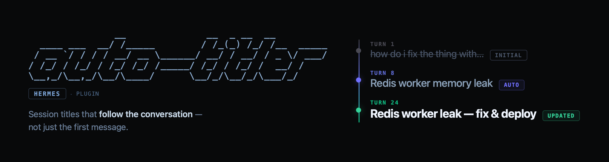

<div align="center">



[](LICENSE)

*Topic-aware session title tracking for [Hermes Agent](https://github.com/NousResearch/hermes-agent), with provenance-safe writes and long-horizon intent tracking.*

[Features](#-features) · [How it works](#-how-it-works) · [Install](#-install) · [Configuration](#%EF%B8%8F-configuration) · [Commands](#-commands) · [简体中文](README.zh-CN.md)

</div>

---

Hermes names a session from its opening exchange, but conversations evolve and titles don't. A chat that starts with *"how do i fix the thing with…"* can turn into an urgent Redis memory leak investigation and production deploy while the sidebar label stays anchored to the first message.

**hermes-auto-titler** maintains session labels across their full lifecycle. It periodically evaluates whether an auto-generated title still reflects the user's actual trajectory, updates the label as the conversation evolves, while respecting user-authored titles as immutable.

```text
┌─ SESSIONS ────────────────────────────────────────────────┐
│  ✦ Redis worker leak                          [AUTO]      │
│    was: how do i fix the thi…                             │
│  ✓ vLLM quant benchmarks                      [KEPT]      │
│    newest: "ok thanks!"                                   │
│  🔒 my research notes                         [USER]      │
│    never overwritten                                      │
│                                                           │
│  derived < llm < user                                     │
└───────────────────────────────────────────────────────────┘
```

## ✨ Features

| | |
|---|---|
| **Provenance-safe** | Enforces `derived < llm < user`. `derived` = Hermes' deterministic fallback from the first message; `llm` = model-generated; `user` = yours, **never overwritten**. Legacy titles without recorded provenance are protected. |
| **Long-horizon intent tracking** | Synthesizes opening turns, recent turns, a bounded user-message trajectory, and historical compaction summaries when the original opening is evicted. Long messages use head+tail extraction to preserve late instructions. |
| **Intent-aware capture** | Filters compaction handoffs, system noise, adjacent replay duplicates, and internal cron/subagent/background turns before they reach the title model. |
| **Evidence-first judgment** | Infers the durable subject from conversation evidence before comparing against current or proposed titles. Explicit, repeated user goals carry highest weight; assistant responses provide context but cannot introduce new topics on their own. |
| **First-turn takeover or coexistence** | `first_title_mode: plugin` (default) evaluates from turn 1 via `pre_llm_call` and disables host built-in title generation at startup. Set to `builtin` to let the host own initial titles. |
| **Conservative / aggressive policy** | `conservative` requires clear, durable mismatch before renaming. `aggressive` responds faster when the user explicitly abandons a goal or sustains a new direction, while still treating one-off subtasks and tool changes as noise. |
| **N-round review gate** | `rename_confirmations: 1` (default): a candidate title needs one follow-up endorsement before writeback. `0` for immediate updates; N for N consecutive endorsements, resetting if the candidate changes. |
| **Optional rename cap** | `max_renames_per_session: 0` (off). Set N to allow at most N automatic replacements per session. Initial naming and manual `rename-now` are exempt. |
| **Custom prompt slot** | `custom_instructions` appends user-defined text to the system prompt — language preferences, prefix conventions, etc. Empty by default. |
| **Call-efficient** | Turn-cadence gating, per-session throttling, provenance checks, in-flight dedup, and internal-turn filtering keep most foreground turns from triggering model calls. |
| **Conservative surface cleanup** | Preserves literal identifiers (commands, paths, code symbols), adds CJK–Latin spacing, and only adjusts casing with direct conversation evidence. |
| **Profile-isolated and auditable** | SessionDB connections are per-profile; all title calls log under `task=hermes_auto_titler` in usage metrics. |

> ⚠️ **Privacy / data flow — read before enabling**
> The plugin sends selected conversation excerpts to the title model: opening and recent turns, a sampled user-message trajectory, compacted history summaries, and attachment filename placeholders. Sampling limits are governed by `opening_turns`, `recent_turns`, `preview_chars`, `include_all_user_messages`, `user_message_threshold`, `user_message_preview_chars`, `summary_preview_chars`, and `retitle_summary_chars`. Model requests count toward your provider's usage and billing.

## 🔍 How it works

1. **First-title ownership** — With `first_title_mode: plugin` (default), the plugin evaluates from turn 1 and disables the host's competing title generator at startup. Set to `builtin` to let the host handle initial titles.
2. **Cadence gating** — Hooks into `on_session_end` and `on_session_finalize`. Only completed foreground turns count toward `every_n_turns` (default `2`); failed, interrupted, cron, subagent, and background turns are excluded. Periodic evaluations run async in a daemon worker; session close evaluations run synchronously (still respecting `min_interval_minutes`).
3. **Context construction** — Extracts opening turns, recent turns (user prompt + final assistant reply), and a bounded trajectory of earliest and latest user prompts. When history compaction has evicted the opening exchange, compaction summaries serve as historical anchors. Protocol handoffs and prompt replays are stripped before sampling.
4. **Evidence-first evaluation** — The auxiliary model outputs structured JSON. Conversation evidence appears before the current title to reduce anchoring bias. Explicit and repeated user intent carries the highest weight; assistant responses support but cannot introduce new topics. Structural overlap between sampled sections is discounted.
5. **Strategy** — `conservative` keeps the existing title unless a significant, durable topic shift has occurred. `aggressive` adapts faster when the user explicitly abandons an earlier objective or sustains a new direction, but recent turns alone are still insufficient to rename.
6. **Multi-round confirmation** — Under `rename_confirmations: N`, proposed `llm` → `llm` renames are held as pending until confirmed across N subsequent evaluations. A different candidate resets the counter. Initial titling, `derived` upgrades, and manual `rename-now` bypass this gate.
7. **Safe writeback** — Provenance is re-validated immediately before writing. Pending candidates are invalidated if the underlying title changes. Duplicate-title suffixes respect width constraints, and writes carry `llm` provenance so user-set titles are never overwritten.

<details>
<summary><b>Design decisions worth knowing</b></summary>

- **Why continuous maintenance instead of better first-message titling?** An opening exchange cannot anticipate where a conversation leads. Long sessions need titles that evolve with the user's actual objectives.
- **Why sample intent trajectory instead of full transcripts?** The title model needs durable intent, not tool execution noise. The plugin preserves opening and recent context alongside a bounded trajectory of key user prompts, using head+tail extraction for long messages.
- **Why infer the subject before inspecting current titles?** Existing titles work as comparison baselines but not as evidence. Analyzing conversation evidence first avoids anchoring on outdated labels.
- **Why evaluate synchronously on session close?** Titles written after termination may never surface in the UI. Synchronous evaluation on close can block up to the provider timeout (~30 s) but ensures the final state is captured.
- **Why require one review endorsement by default?** A single rename trigger can reflect a temporary detour. Requiring one subsequent endorsement provides a defense against title flutter; set `rename_confirmations: 0` for immediate updates, or increase N for stricter stability.
- **Known limitation:** Hermes does not provide an atomic compare-and-swap API for session titles, leaving a narrow race window during concurrent writes. The plugin mitigates and detects these collisions.

</details>

## 📦 Install

**Recommended — via the Hermes plugin installer:**

```bash
hermes plugins install https://github.com/Vocllum/hermes-auto-titler --enable
```

This clones the repo into `~/.hermes/plugins/`, generates `config.yaml` from the bundled template, and enables the plugin.

**Manual alternative:**

```bash
cd ~/.hermes/plugins
git clone https://github.com/Vocllum/hermes-auto-titler
cp hermes-auto-titler/config.yaml.example hermes-auto-titler/config.yaml
```

By default, the plugin uses Hermes' built-in `title_generation` auxiliary task, so the host owns the provider/model choice. To use a plugin-local route instead, set `provider` and/or `model` in the plugin config. The host must authorize the selected mode:

```yaml
# ~/.hermes/config.yaml
plugins:
  enabled:
    - hermes-auto-titler
  entries:
    hermes-auto-titler:
      llm:
        allow_provider_override: true
        allow_model_override: true
        allow_task_override: true
```

Restart Hermes, then verify:

```text
/autotitler status
```

### Which model does it use?

**Hermes auxiliary mode (default).** Leave `provider` and `model` empty. The plugin calls Hermes' `title_generation` task, and Hermes resolves `auxiliary.title_generation.provider` / `model`.

**Plugin custom mode (optional).** Set `provider` and/or `model` in `~/.hermes/plugins/hermes-auto-titler/config.yaml`:

```yaml
provider: "your-provider"   # provider already configured in Hermes
model: "your-model"         # any model your Hermes setup can reach
```

- Hermes auxiliary mode needs `allow_task_override: true` so the plugin can borrow the `title_generation` task.
- Plugin custom mode needs `allow_provider_override: true` / `allow_model_override: true`. The plugin never stores a separate API key.
- This channel is only for title evaluation; your main conversation keeps its own model.
- `/autotitler status` shows the configured route. When it says `(host default)`, check Hermes' `auxiliary.title_generation` config for the actual provider/model.

**Model guidance.** The plugin runs well on small, fast instruction-following models. Prioritize consistent JSON output, multilingual comprehension, and prompt adherence over heavy reasoning. Start with Hermes' normal auxiliary title route. Before deploying an ultra-light model, test `scripts/review_sample.py` against your own session history — if you see topic drift, invalid JSON, or degraded multilingual titles on long or compacted sessions, switch to a more capable model.

**Requirements:** Python ≥ 3.11 · a recent Hermes Agent.

> **Takeover-mode note:** `first_title_mode: plugin` disables Hermes' built-in title generator at plugin load. Changing `first_title_mode` at runtime does not replay that startup action, and switching back to `builtin` does not re-enable a previously disabled host generator. Treat ownership changes as restart-time config and verify `auxiliary.title_generation.enabled` when switching back.

> **Install-layout note:** Place the plugin directly at `~/.hermes/plugins/hermes-auto-titler/`. If you symlink the package directory, `config.yaml` must live where the package physically resides (config resolves relative to the package).

## ⚙️ Configuration

`~/.hermes/plugins/hermes-auto-titler/config.yaml` — every key is optional; invalid values fall back to defaults.

<details>
<summary><b>All keys</b></summary>

| Key | Default | What it does |
|---|---|---|
| `enabled` | `true` | Master switch. Enabling after a disabled startup requires a restart (no hooks registered); disabling a loaded plugin takes effect immediately via the hook guard. |
| `every_n_turns` | `2` | Evaluate every N completed foreground turns. |
| `first_title_mode` | `plugin` | `plugin` = evaluate from turn 1, disable host title generator at load; `builtin` = Hermes owns first-title generation. Treat changes as restart-level config. |
| `early_turn_eval` | `false` | Legacy compat key. Actual behavior is controlled by `first_title_mode`. |
| `on_close` | `true` | Evaluate on session close/finalize (synchronous, throttled). |
| `recent_turns` / `opening_turns` | `2` / `2` | Context window in real user turns; each selected turn keeps the user message + last assistant reply. |
| `ignore_model_messages` | `false` | Exclude assistant messages from captured context (A/B testing). |
| `preview_chars` | `400` | Per-message preview budget for opening/recent context. Multi-sentence messages use head+tail extraction. |
| `include_all_user_messages` | `true` | Append the sampled user-message trajectory. |
| `user_message_threshold` | `40` | Max trajectory length; over the limit, keep the first message + most recent N−1. `0` = unlimited. |
| `user_message_preview_chars` | `300` | Per-message trajectory budget with head+tail extraction. `0` = unlimited. |
| `summary_preview_chars` | `1200` | Compaction-summary budget for normal evaluations. |
| `retitle_summary_chars` | `12000` | Compaction-summary budget for blind/manual/bulk regeneration; `0` falls back to `preview_chars`. |
| `title_style` | `concise` | `concise` = subject label · `complete` = short event/intent summary (wider display budget). |
| `strategy` | `conservative` | `conservative` = rename only on material durable mismatch; `aggressive` = follow explicit goal abandonment or sustained new direction sooner, ignoring one-off subtasks and tool changes. |
| `provider` / `model` | `""` / `""` | Both empty = Hermes `title_generation` auxiliary task; set either for a plugin custom route. |
| `min_interval_minutes` | `5` | Minimum gap between evaluations of one session. |
| `max_title_length` / `max_display_width` | `null` / `40` | `null` avoids hard character slicing; the prompt keeps titles brief and `max_display_width` caps display columns. `complete` style adds 12 columns. |
| `rename_confirmations` | `1` | Require one later endorsement before llm→llm writeback. `0` = immediate; `N > 1` = N endorsements. Replacing the pending candidate restarts the count. |
| `max_renames_per_session` | `0` | Off by default. `N > 0` caps automatic replacements per session. Initial naming and `rename-now` are exempt; upgrading `derived` counts as a replacement. Counter is process-local. |
| `custom_instructions` | `""` | Text appended to the title-generation system prompt. E.g. `"Always use English for titles"` or `"Prefix every title with [Project]"`. Empty = no effect. |

</details>

## 🕹️ Commands

```text
/autotitler status                                     # current config/state
/autotitler config <key> [value]                       # view/set config (persisted)
/autotitler rename-now [session_id]                    # blind-regenerate; bypasses review gate
/autotitler retitle-all [--dry-run] [--limit N] [--min-messages N]   # bulk blind regeneration
```

Most options take effect immediately. `enabled` requires a restart if hooks were not registered at startup; `first_title_mode` is a startup-level ownership switch.

`rename-now` performs blind regeneration: the current title is withheld from the model to eliminate anchoring, and the confirmation gate is bypassed. `retitle-all --dry-run` simulates bulk updates without API calls or data changes. Without `--dry-run`, user-set titles are preserved and only eligible automatic titles are regenerated.

## 💰 Cost

**Input size per evaluation is bounded, not fixed.** Opening and recent turns use `preview_chars=400` by default; the user trajectory keeps up to 40 messages at up to 300 chars each; compaction summaries can add up to 1,200 chars. Short conversations use far fewer tokens, but long sessions with full trajectories can exceed the typical 1–3K character baseline.

The plugin requests `max_tokens=64`, but some OpenAI-compatible providers may not enforce output limits upstream. During benchmark runs, an unconstrained model produced **597 input / 1,639 output tokens** due to internal reasoning before emitting JSON. Budget for your provider's actual token accounting, not a hard 64-token ceiling.

**Cadence gating is the primary cost guard:** turn-interval checks (`every_n_turns`), per-session cooldowns (`min_interval_minutes`), provenance validation, in-flight dedup, and background-turn filtering prevent redundant calls. Every call is logged under `task=hermes_auto_titler` in Hermes usage metrics.

A lightweight auxiliary model fits the intended cost profile, but verify against your own transcripts — especially long, compacted sessions.

## 🧪 Development

```bash
uv venv .venv && uv pip install --python .venv/bin/python pytest PyYAML
.venv/bin/python -m pytest tests/ -v
<your-hermes-checkout>/venv/bin/python scripts/integration_check.py
<your-hermes-checkout>/venv/bin/python scripts/review_sample.py --n 20
<your-hermes-checkout>/venv/bin/python scripts/review_sample.py --n 20 --strategy aggressive
<your-hermes-checkout>/venv/bin/python scripts/prompt_acceptance.py --n 8 --seed 17 --output /tmp/title-experiment.jsonl
<your-hermes-checkout>/venv/bin/python scripts/e2e_check.py <session_id>
```

`review_sample.py` runs in dry-run mode, mirroring the production context config (preview lengths, trajectory limits, summary budgets).

`prompt_acceptance.py` is an isolated experiment harness: it samples real non-user-titled sessions, replays chronological prefixes (e.g. turns 1, 2, 4, final), evaluates prompt variants on identical prefixes, and optionally scores titles with a separate LLM judge. Defaults to Hermes' `PluginLlm` bridge via the `title_generation` task; raw OpenAI-compatible endpoints can be configured via `HERMES_AUTOTITLER_EXPERIMENT_*` env vars. Strictly read-only against SessionDB — existing titles are hidden during generation and judging.

`retitle_all.py --dry-run` previews bulk regeneration without model calls or DB writes. Without `--dry-run`, user-set titles are preserved and only eligible automatic titles are updated.

## 📄 License

[Apache-2.0](LICENSE)

<div align="center">
<sub>Built by <a href="https://github.com/Vocllum">Vocllum</a></sub>
</div>
